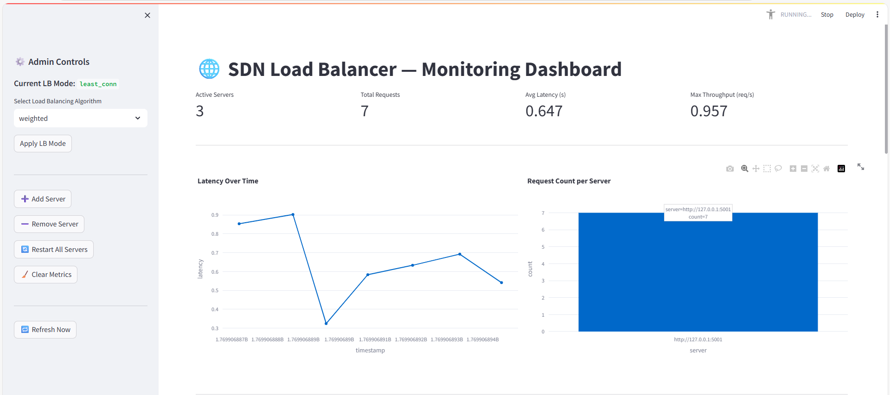
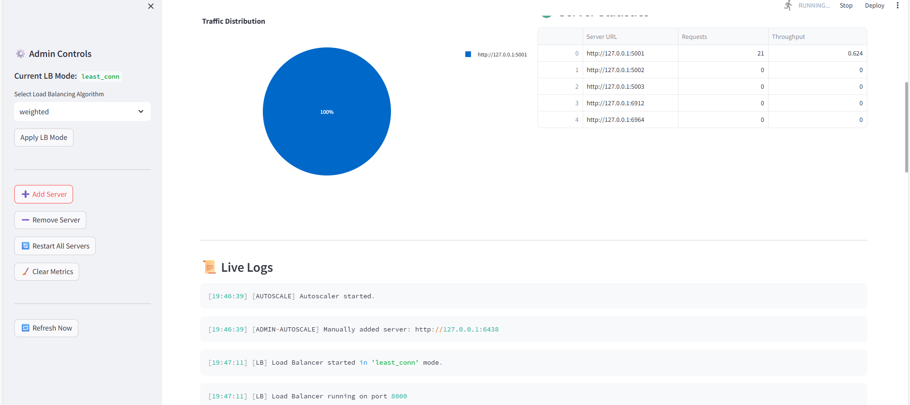

# SDN-Based Intelligent Load Balancer with Predictive Autoscaling

## 📌 Overview

This project is a Python-based simulation of a Software Defined Networking (SDN) load balancing platform.  
It demonstrates intelligent traffic routing, health monitoring, predictive autoscaling, and real-time visualization.

The system dynamically distributes incoming client requests across multiple backend servers using different load balancing strategies while continuously collecting metrics and adjusting resources automatically.

---

## 🚀 Key Features

- Multiple Load Balancing Algorithms:
  - Round Robin
  - Random
  - Least Connection
  - CPU-Weighted

- Predictive Autoscaling (latency-driven)
- Heartbeat-based Health Monitoring
- Automatic Recovery of Failed Servers
- Dynamic Server Registry
- Real-time Metrics Collection
- Streamlit Monitoring Dashboard
- Admin Control Panel:
  - Change LB mode
  - Add/remove servers
  - Restart servers
  - Clear metrics
- Live Traffic Generator

---

## 🧠 System Architecture

Client Traffic  
→ Load Balancer (Flask :8000)  
→ Backend Servers (Flask microservices)  
→ Metrics Engine (metrics.json + lb.log)  
→ Streamlit Dashboard  

Parallel Services:
- Heartbeat Monitor
- Autoscaler
- Predictive Scaler

---

## 🛠 Technologies Used

- Python (make sure to only use python 3.11.x version only)
- Flask
- Streamlit
- Plotly
- Pandas
- Requests
- NumPy

---

## ▶️ How to Run

### Step 1 — Install Dependencies

Open terminal in project root:

pip install -r requirements.txt

---

### Step 2 — Start Backend Servers

Terminal 1:
cd servers
python server1.py

Terminal 2:
cd servers
python server2.py

Terminal 3:
cd servers
python server3.py

---

### Step 3 — Start Load Balancer Services

Terminal 4:
cd load_balancer
python heartbeat.py

Terminal 5:
cd load_balancer
python autoscale.py

Terminal 6:
cd load_balancer
python balancer.py

---

### Step 4 — Start Dashboard

Terminal 7:

cd dashboard
streamlit run dashboard.py

Open browser at:

http://localhost:8501

---

### Step 5 — Generate Traffic

Terminal 8:

cd clients
python traffic_test.py

Traffic is sent to:

http://127.0.0.1:8000

---

## 📊 Dashboard Capabilities

- Live latency graphs
- Request distribution
- Server statistics
- Traffic visualization
- Admin controls for system management

---

## 📈 Autoscaling Logic

- Average latency > 0.9s → Add server
- Average latency < 0.2s → Remove server

Scaling decisions are made automatically using recent performance trends.

---

## 🎯 Educational Value

This project demonstrates core concepts of:

- Software Defined Networking
- Distributed Systems
- Load Balancing Algorithms
- Cloud Autoscaling
- Observability & Monitoring
- Fault Tolerance

---
## 📸 Dashboard Screenshots

### Monitoring Overview

---

### Traffic Distribution & Server Statistics

## 👨‍🎓 Author

Bandapalli Chirudeep  
Master’s Student  

---

## 📜 License

This project is for academic and educational purposes.
